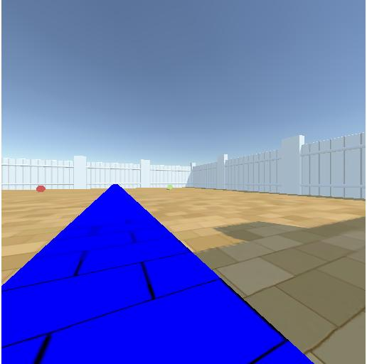
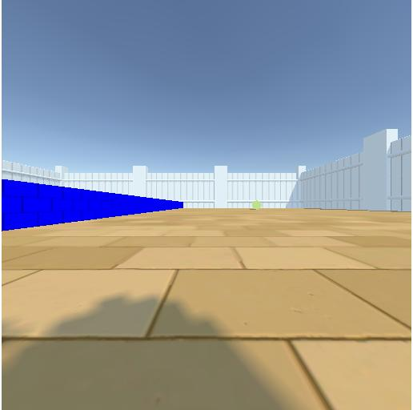

Below, we provide a more detailed look into the run animated in [run.gif](example_run/run.gif).

This is a run of gpt-o4-mini in task 02-10-01 of the Animal-AI competition.

(initial image: no response) 

(initial image: no response)

Think('I see a green ball slightly to my right at approximately 15 steps away and a red ball to my left');Turn(25);

Think('The green ball is slightly to my right about 15 steps away; I will move forward to collect it, avoiding the red lava ball');Go(20);

Think('The green ball is directly ahead about 30 steps and I am oriented 25 degrees to the right; I will turn left 25 degrees to face it');Turn(-25);

Think('Green ball is centered ahead approximately 30 steps away; I will move half the distance first');Go(15);

Think('The green ball is slightly to my right about 10 steps away');Turn(25);

Think('The green ball is centered ahead about 8 steps away; I will move to collect it');Go(10);

Think('I did not collect the green ball and my health dropped; I see a fence corner, so I need to turn around to relocate the ball');Turn(180);

Think('The green ball is behind me to the left about 20 steps away at roughly 45 degrees off center');Turn(-45);

Think('The green ball is directly ahead centered approximately 6 steps away');Go(10);