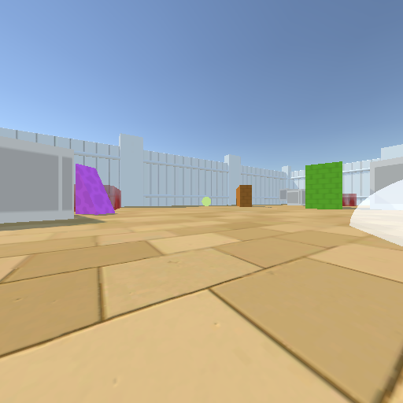

\textit{Supervised Fine-tuning} (SFT) is an additional training step sometimes used to improve the performance of an LLM in a specific task domain. We performed SFT on the model GPT-4o (checkpoint gpt-4o-2024-08-06) for three epochs. The model was fine-tuned on pairs of a single frame, presented as in LLM-AAI, and the ideal response of the LLM. Frames were drawn from randomly generated configurations in which there was a single goal (green or yellow), within the agent's line of sight, with randomly generated items filling the rest of the arena.

Training datapoints were of one of three types (shown in the images below the text)):

- \texttt{Think(I'll turn to align myself with the goal that appears to be [ANGLE] degrees to my [LEFT / RIGHT]);Turn([ANGLE]);}
- \texttt{Think(The goal is directly ahead at a distance of [DISTANCE], I can go forwards to retrieve it);Go([DISTANCE]);}
- \texttt{Think(The goal is ahead but far away, I'll move so that I am in its vicinity);Go([DISTANCE]);}

In the latter two, the agent was orientated so that the goal was directly ahead, while in the first the goal was somewhere in its field of vision. Training examples were balanced so that half referenced turning (example type one) and half referenced going (types two and three). For the `going' examples, type 2 was used if the goal was less than 17.5 units away from the agent and type 3 was used if the goal was greater than or equal to 17.5 units.

Examples from the fine-tuning dataset, respectively showing type 1, 2, and 3 datapoints:

