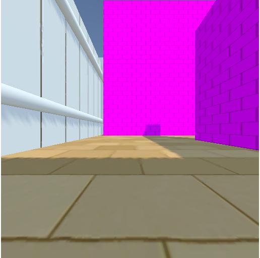
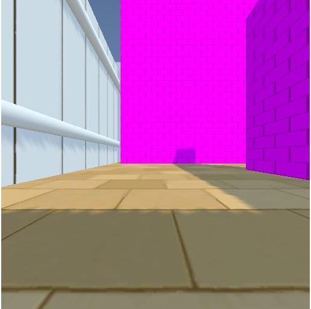
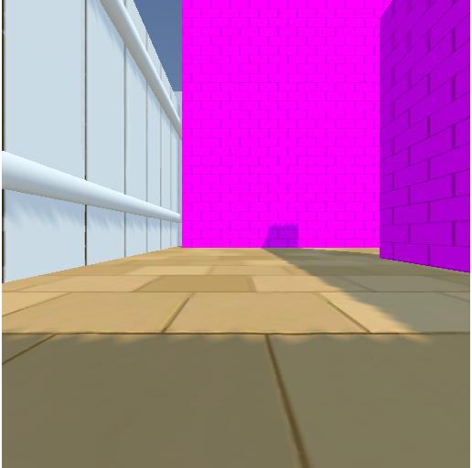
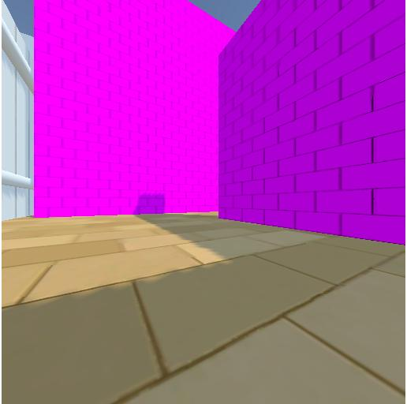

In Experiment 2, we provided the LLMs with the original prompt from Experiment 1 (see [Experiment 1's prompt](prompt-experiment1.md)) accompanied by a demonstration of an episode, which included examples of objects it may encounter in AAI. We replicate this below in human-readable format; with observations in sequence, and their responses below. For an animated GIF of this episode, see [prompt-experiment2.gof](prompt-experiment2.gif)

(1/3 initial images: no response)

(2/3 initial images: no response) 

(3/3 initial image: no response)

assistant: Think("I can move forwards and backwards with Go");Go(3);

user: Environment observation captured:

ENVIRONMENT: Your remaining health is  96.9.

assistant: Go(-3);

user: Environment observation captured:

ENVIRONMENT: Your remaining health is  96.7.

assistant: Think("I can turn left and right with Turn");Turn(30)

user: Environment observation captured:

Ready to play? You will start by seeing three image observations.  
A new level begins now. Environment observation captured  
